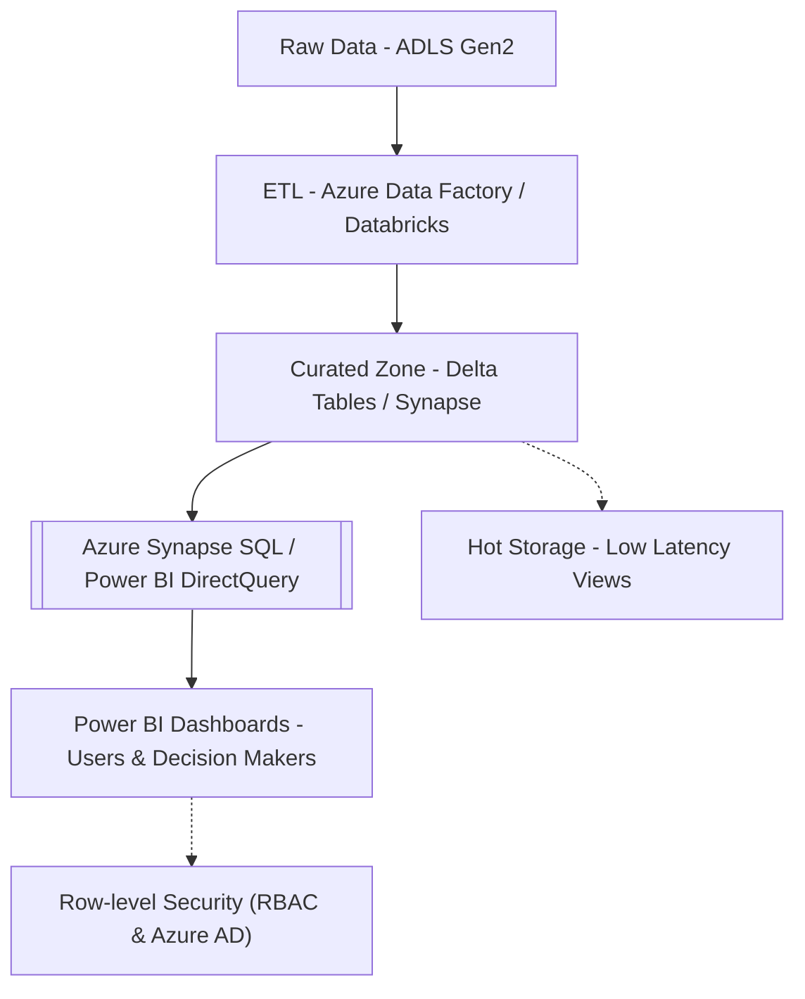
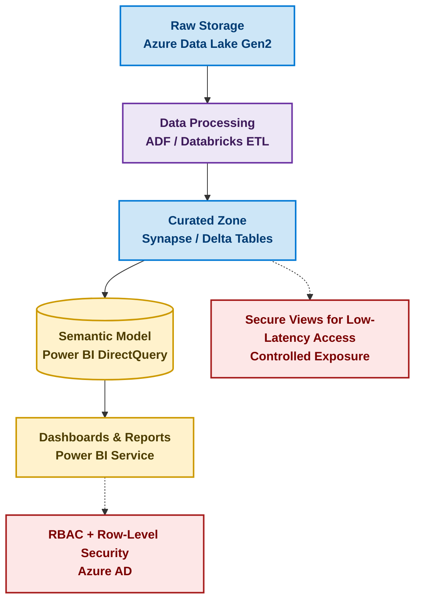

# 📊 Dashboards & Analytics — Business Intelligence Layer

This document describes how analytics insights are exposed to end users such as:
- 🧑‍💼 Underwriters (risk support, decision confidence)
- 🎯 CRM / Marketing (next-best-offer targeting, retention tracking)
- 🧑‍⚖️ Executives (operational KPIs & business outcomes)

---

## 🎯 Objectives

- Provide a **single pane of glass** for customer intelligence
- Support **loan decisioning** through risk scores + explainability
- Enable **proactive retention** and **new customer acquisition**
- Measure **pipeline health**, **SLAs**, and **customer experience KPIs**

---

## 🧩 Data Flow into Power BI (Azure Cloud)

Data ingestion into Power BI follows governed access from the **Curated (Gold) Zone**:

## 🧩 Data Flow into Power BI (Azure Cloud)

Operational and ML-derived insights are consumed through secure and governed dashboards in Power BI.
Only validated and privacy-compliant data from the Curated (Gold) Zone is exposed to business users.

Access is tightly controlled using:

Azure AD authentication

Role-Based Access Control (RBAC)

Row-Level Security (RLS) → users only see authorized region/customers

Data masking for high-risk PII fields (e.g., account numbers)

Audit logs for dashboard views & data access

This ensures analytics helps accelerate decisioning without compromising financial data security.

