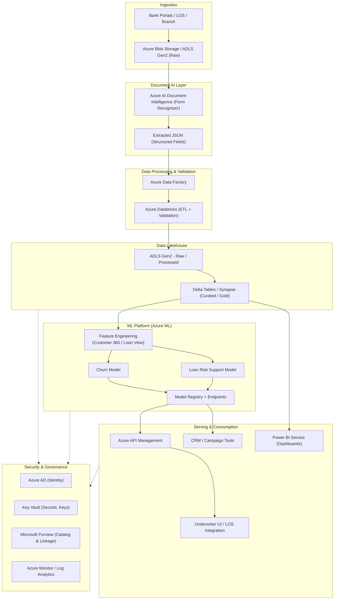

# 🌐 Azure Architecture — Customer Insights & Loan Process Optimization

This document describes how the solution is deployed on **Microsoft Azure**, aligned with the
code structure in this repository:

- `data_pipeline/` → Data ingestion, extraction, validation
- `ml/` → Feature engineering and ML models
- `dashboards/` → BI & reporting
- `config/` → Environment-specific configuration

The goal is to provide a **secure, scalable and governed** platform for:
- Document ingestion and digitization
- Customer 360 and loan risk analytics
- Churn, loan risk and next-best-offer ML models
- Dashboards for underwriters, CRM and executives

---

## 1. Core Azure Services Mapping

| Layer | Purpose | Azure Services |
|------|---------|----------------|
| Ingestion & Storage | Raw document landing and structured zones | Azure Blob Storage / ADLS Gen2 |
| Document AI | OCR + key-value extraction | Azure AI Document Intelligence (Form Recognizer) |
| Orchestration | Pipelines for ETL & ML | Azure Data Factory, Azure Databricks |
| Data Warehouse / Lakehouse | Curated / Gold zones | Azure Synapse Analytics, Delta Lake |
| ML Platform | Training, registry, endpoints | Azure Machine Learning |
| Serving APIs | Underwriter & CRM access | Azure Kubernetes Service (AKS) or Azure Container Apps, Azure API Management |
| Identity & Security | Authentication & authorization | Azure Active Directory, Key Vault |
| Monitoring & Logging | Observability & audit | Azure Monitor, Log Analytics, Application Insights |
| Governance | Catalog, lineage, classification | Microsoft Purview |

---

## 2. High-Level Azure Architecture (End-to-End Flow)

