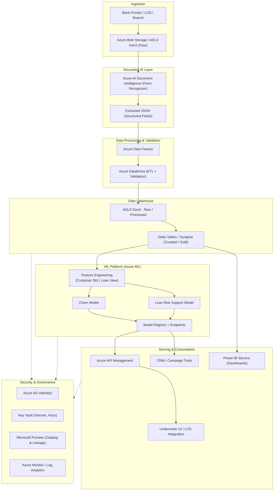
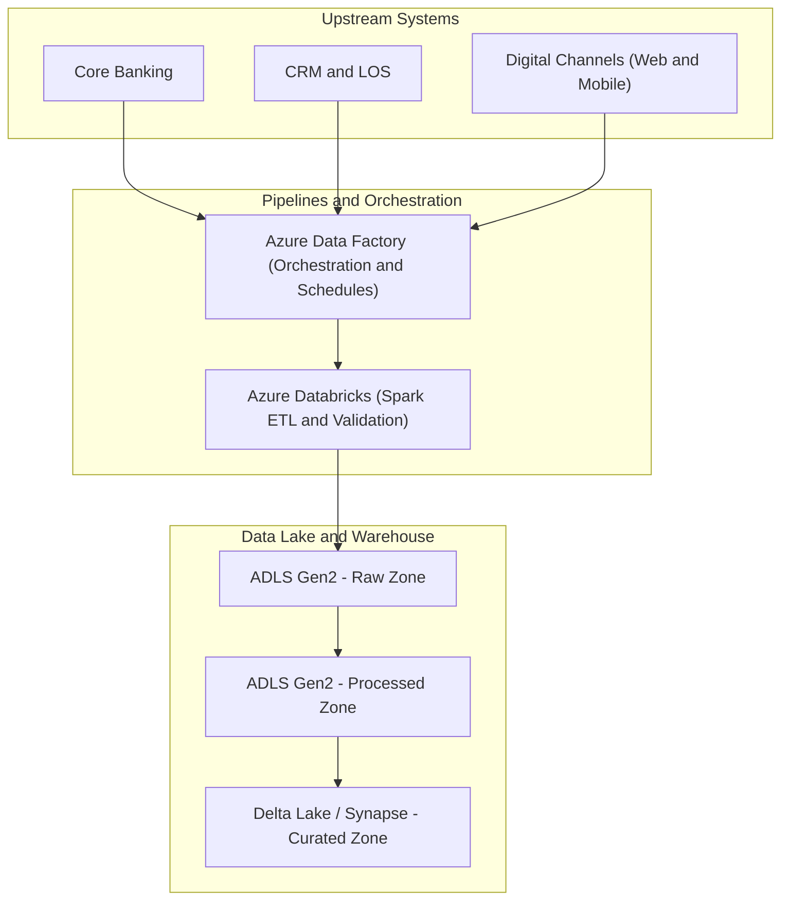
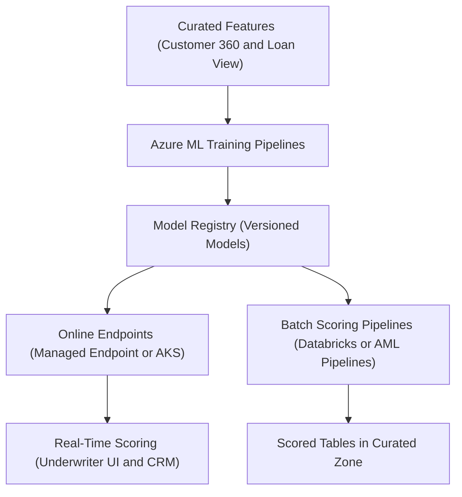
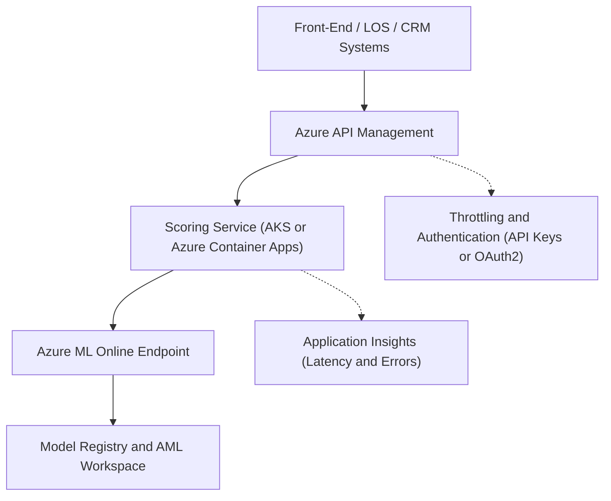

# 🌐 Azure Architecture — Customer Insights & Loan Process Optimization

This document describes how the solution is deployed on **Microsoft Azure**, aligned with the
code structure in this repository:

- `data_pipeline/` → Data ingestion, extraction, validation
- `ml/` → Feature engineering and ML models
- `dashboards/` → BI & reporting
- `config/` → Environment-specific configuration

The goal is to provide a **secure, scalable and governed** platform for:
- Document ingestion and digitization
- Customer 360 and loan risk analytics
- Churn, loan risk and next-best-offer ML models
- Dashboards for underwriters, CRM and executives

---

## 1. Core Azure Services Mapping

| Layer | Purpose | Azure Services |
|------|---------|----------------|
| Ingestion & Storage | Raw document landing and structured zones | Azure Blob Storage / ADLS Gen2 |
| Document AI | OCR + key-value extraction | Azure AI Document Intelligence (Form Recognizer) |
| Orchestration | Pipelines for ETL & ML | Azure Data Factory, Azure Databricks |
| Data Warehouse / Lakehouse | Curated / Gold zones | Azure Synapse Analytics, Delta Lake |
| ML Platform | Training, registry, endpoints | Azure Machine Learning |
| Serving APIs | Underwriter & CRM access | Azure Kubernetes Service (AKS) or Azure Container Apps, Azure API Management |
| Identity & Security | Authentication & authorization | Azure Active Directory, Key Vault |
| Monitoring & Logging | Observability & audit | Azure Monitor, Log Analytics, Application Insights |
| Governance | Catalog, lineage, classification | Microsoft Purview |

---

## 2. High-Level Azure Architecture (End-to-End Flow)

## 4. Data Platform Architecture (Zones and Pipelines)

Data is organized into raw, processed, and curated zones with orchestrated pipelines.

## 5. Raw Zone – immutable copies of source extracts and documents.

Processed Zone – cleaned, typed, schema-aligned data.

Curated Zone – Customer 360 views, loan facts, model scoring outputs.

data_pipeline/ in this repo conceptually maps to P1 + P2 + DL1 + DL2.

5.1 ML Platform on Azure (Training and Scoring)

Azure ML handles training, model registry, and deployment of scoring endpoints.

5.2 Components

Azure ML workspace, compute clusters

Model registry (versioned models)

Online endpoints (managed endpoint or AKS)

ML pipelines for training and batch scoring

Model lifecycle details are in /ml/model_lifecycle.md.

5.3 ML Flow

## 6. Networking, Security and Compliance

Networking and security ensure private, compliant access to all data and services.

6.1 Networking

Hub-spoke VNet design with separate spokes for Data, ML, and App layers.

Private endpoints for:

Blob / ADLS Gen2

Synapse

Azure ML workspace

Key Vault

Optional ExpressRoute / VPN for secure on-prem connectivity.

## 6.2 Identity and Access

All access via Azure AD.

RBAC groups such as:

Data-Engineer, Data-Scientist, Underwriter, Risk-Model-Owner, BI-Consumer.

Managed Identities for Data Factory, Databricks, AML Pipelines, Power BI.

## 6.3 Secrets and Keys

All secrets in Azure Key Vault.

Services retrieve secrets via Managed Identity, not in code.

## 6.4 Compliance Controls

PII:

Masking / tokenization and restricted raw-zone access.

Audit:

Logging scoring requests, model version, and user identity in Log Analytics / Monitor.

Data Residency:

Multi-region ADLS and Synapse, region-aware routing and Power BI RLS.

## 7. API and Serving Layer

Real-time APIs expose ML scores to LOS, CRM, and other front-end systems.

## 7.1 API Architecture

## 8. CI/CD and Infrastructure as Code (Conceptual)

CI/CD ensures repeatable, audited deployments across Dev, Test, and Prod.

IaC with Bicep / ARM or Terraform for:

Resource groups, VNets, ADLS, Synapse/Databricks, AML, API Management, Key Vault, etc.

Pipelines using Azure DevOps or GitHub Actions with stages:

Build → validate templates, lint Python, run tests

Deploy-Dev → provision/update Dev infra, register models

Deploy-Test → gated approvals and integration tests

Deploy-Prod → final approvals, blue/green or canary deployment

